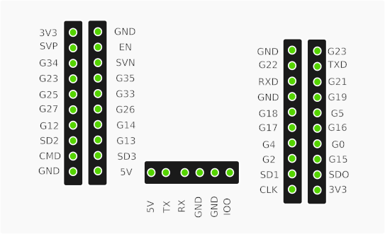

# ShopDoor

ShopDoor is an ESP32-based garage/shop door controller that exposes a simple web UI and HTTP API for opening, closing, stopping the door, and controlling a light connected to the fourth relay. This controller as coded is intended to work with a triple-pole, double-throw switch intended for large shop doors. (See below for diagrams.)

## Features
- Control door with capacitive touch sensors or web UI
- Relays for open/close/stop and a separate relay for a light
- Simple web UI served by the ESP32
- HTTP API endpoints for programmatic control

## Hardware / Pinout
These pin definitions are in `src/main.cpp` (macros shown):

- `TOUCH_OPEN` — GPIO 4 (capacitive touch: open)
- `TOUCH_CLOSE` — GPIO 2 (capacitive touch: close)
- `TOUCH_STOP` — GPIO 15 (capacitive touch: stop)
- `TOUCH_LIGHT` — GPIO 27 (capacitive touch: light)

- `OPEN_RELAY` — GPIO 32 (relay 1 — open pulse)
- `CLOSE_RELAY` — GPIO 33 (relay 2 — close hold)
- `STOP_RELAY` — GPIO 25 (relay 3 — stop)
- `LIGHT_RELAY` — GPIO 26 (relay 4 — light on/off)

- `SENSOR1_PIN` — GPIO 12 (reed/magnetic sensor 1)
- `SENSOR2_PIN` — GPIO 14 (reed/magnetic sensor 2)

Wire your relays and sensors according to those GPIO pins. The project uses active HIGH to enable relays in the current code (writing `HIGH` activates), and pins are initialized `LOW` in setup.

## Software prerequisites
- PlatformIO (recommended via VSCode PlatformIO extension) or `platformio` CLI
- Arduino framework for ESP32 is used via PlatformIO environment (see `platformio.ini`)
- A `secrets.h` file in `include/` containing `WIFI_SSID`, `WIFI_PASSWORD`, and optionally `NTFY_SERVER` (there is an example `secrets.h` in `include/`)

## Building and Uploading
From the project root (`ShopDoor`):

```bash
# Build
platformio run --environment esp32doit-devkit-v1

# Upload to a connected ESP32
platformio run --target upload --environment esp32doit-devkit-v1
```

Or use the PlatformIO extension UI in VSCode to Build and Upload.

## Web UI
Open a browser to the ESP32's IP address (printed over serial after Wi-Fi connects).
The root page (`/`) contains:
- Door state text (Closed, Moving/Open)
- Light state text (Light: ON / Light: OFF)
- Buttons: Open, Close, Stop, Toggle Light

The web UI polls the device every second to update door and light status.

## HTTP API
- `POST /api/open` — Open the door (pulse open relay).
- `POST /api/close` — Close the door (hold close relay for configured duration).
- `POST /api/stop` — Stop door (triggers stop relay briefly).
- `POST /api/light` — Toggle light relay (turns light on if off, off if on).
- `GET  /api/state` — Returns JSON with door and light state, e.g.:

```json
{"state":"Closed","light":true}
```

Note: The `light` field is boolean.

## Device notes
- The device this program is made for is the ESP32 WiFi 4 Channel Relay Module ESP32-WROOM-32E 4 Channel Development Board AC/DC Power Supply Switch Controller Board for Arduino Smart Home Wireless Control.  I got mine from Amazon, but there are other distributors out there.
- The distributor includes no pinout in the packaging so I've included it here.
 
Below are the board pinout images I took and included in this repo (files live in `readme_images/`).




### Stop Function
To maintain original function, the power from the control circuit must go through the normally closed relay first, then through the stop button.  This stops power through the circuit stopping the door as usual through both the relay and the button. 

### Open Function
When the open relay is activated it goes from an open to closed position.  Since the power going through the relay is the same as what happens when pressing the power button on the control station, the door opens.

### Close Function
When the "close" relay is activated it goes from an open to closed position.  This sends the signal to the door opener the same as pressing the close button.

### Light Function
Activating this closes the fourth relay which has no effect on the door, but is instead intended for a light control.  I have a 12v power supply and some LED strip lights connected through mine.

## Notes and recommendations
- `lightOn` state is held in RAM and is not persisted across reboot. If you want persistence, we can add `Preferences` or EEPROM storage to save and restore the light state on boot.
- The `secrets.h` file in `include/` should not be checked into version control; an example file is provided as `include/example secrets.h`.
- Adjust `closeTime` and touch thresholds in `src/main.cpp` to match your hardware and door timing.

## Troubleshooting
- If the device doesn't connect to Wi-Fi, check `secrets.h` values and serial output for errors.
- If `platformio` is not found on your machine, install via pip:

```bash
pip3 install platformio
```

or install the PlatformIO VSCode extension.

## License
Add your preferred license here.
